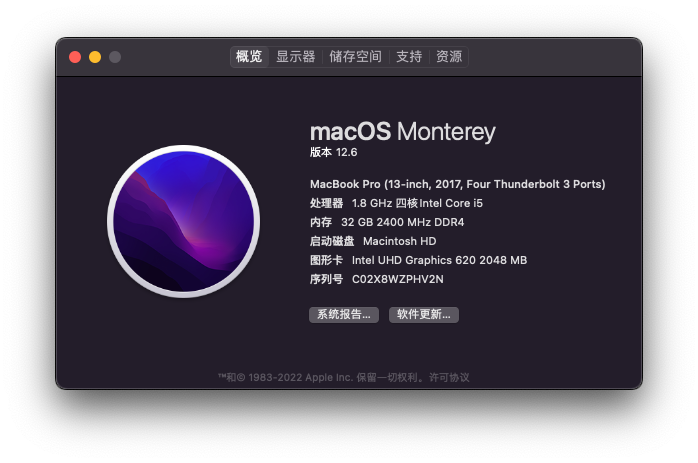
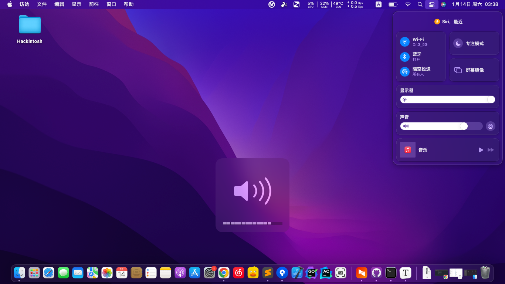
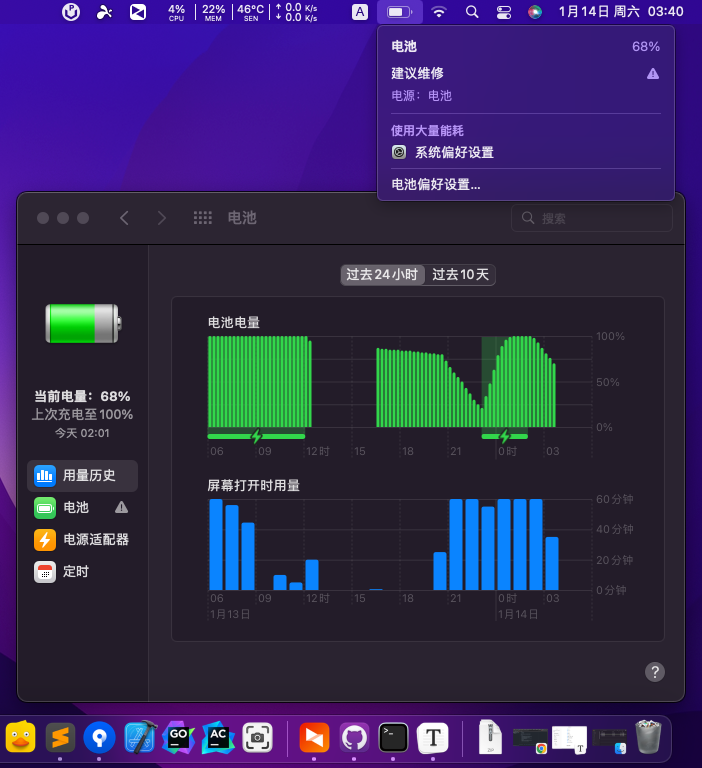
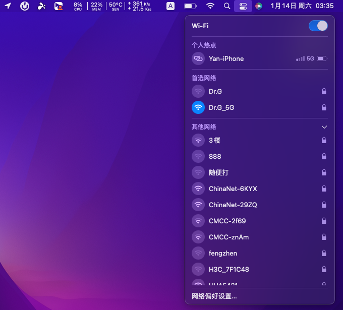
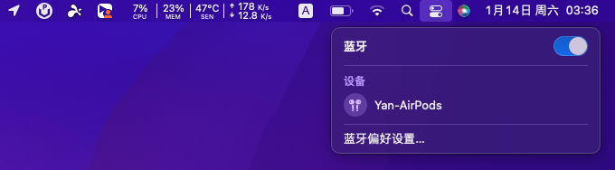

# Hackintosh-Dell-Latitude-E7490
Hackintosh macOS OpenCore EFI

> 注意：当前仓库存放了针对macOS不同版本的EFI引导文件，各个版本的区别在于网卡驱动是针对不同版本进行编译，具有版本适配性
>
> 不同版本的分支如下：
>
> - [`Monterey`分支](https://github.com/Sinton/Hackintosh-Dell-Latitude-E7490/tree/Monterey): macOS 12.6.2
>
> - [`Catalina`分支](https://github.com/Sinton/Hackintosh-Dell-Latitude-E7490/tree/Catalina)：macOS 10.15.7

##  黑苹果效果预览：

	

##  配置：Dell Latitude E7490

- CPU：Intel i5-8250U（Kaby-Lake-R）
- iGPU：Intel UHD620
- 分辨率：1366 * 768
- 内存：16GB * 2（DDR4 2400Hz）
- SSD：SanDisk 500GB（WD Blue SN570 马甲盘）
- 蓝牙：板载无线 BT 4.2 (vPro)
- 有线网卡：Intel I219-LM
- 无线网卡：Intel Dual-Band Wireless-AC 8265 + BT4.2
- 声卡：Realtek ALC256

## 正常工作：

- [x] 核显
- [x] 蓝牙
- [x] 有线网卡
- [x] WiFI（2.4 + 5G Hz）
- [x] 音响喇叭、麦克风
- [x] HDMI
- [x] USB 3.0
- [x] Type-C
- [x] 摄像头
- [x] 电池管理
- [x] 睡眠（熄屏，唤醒）
- [x] 屏幕亮度快捷键
- [x] 键盘
- [x] 3.5 mm 耳机
- [x] MicroSD 读卡器

## 无法工作：

- [ ] 触摸板
- [ ] TrackPoint（键帽红点）
- [ ] 隔空投送

## `BIOS`设置
在 OpenCore 引导中运行 Grubshell.efi 执行相关的grub命令:

### DVMT:

BIOS 地址：0x804

`grub`执行命令：setup_var 0x804 0x2

BIOS 地址：0x8045

`grub`执行命令：setup_var 0x805 0x3

### CFG Lock:

BIOS 地址：0x52D

`grub`执行命令：setup_var 0x52D 0x0
